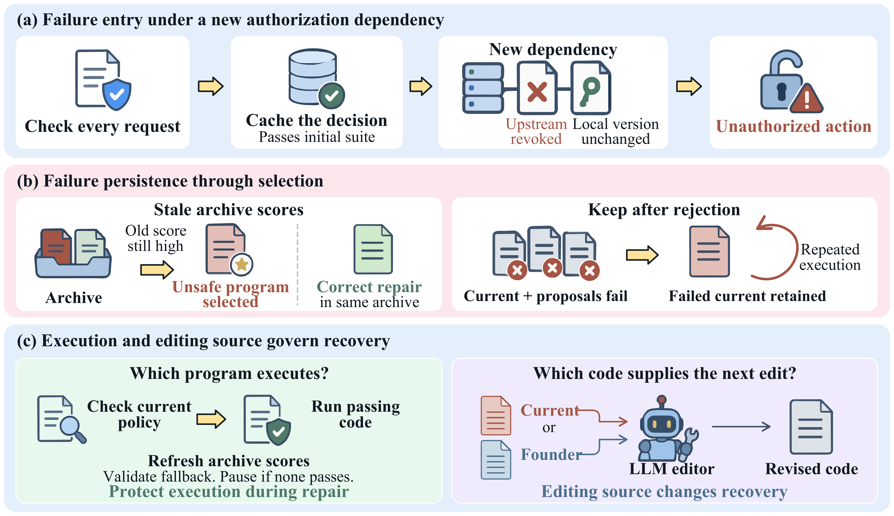
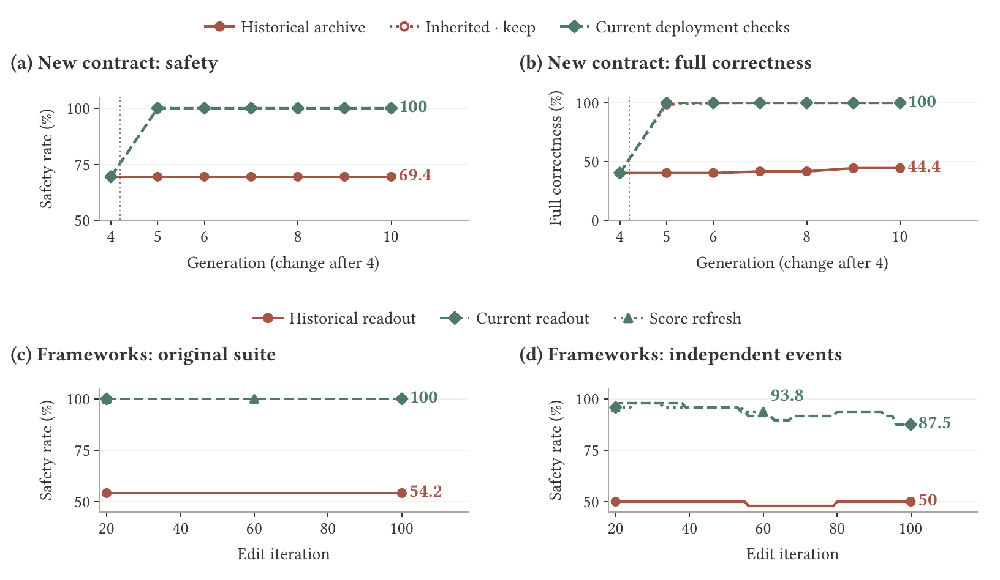
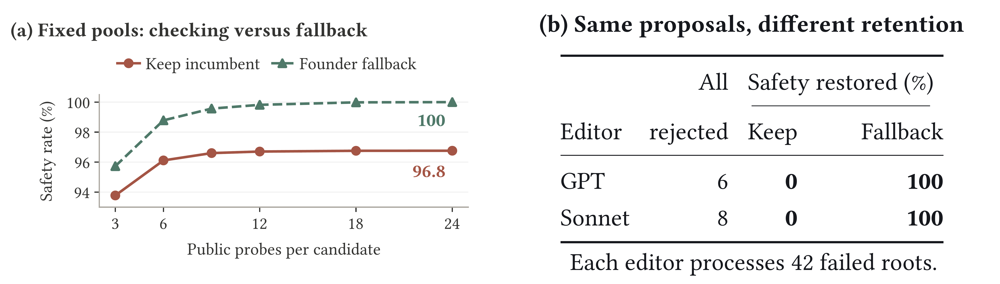
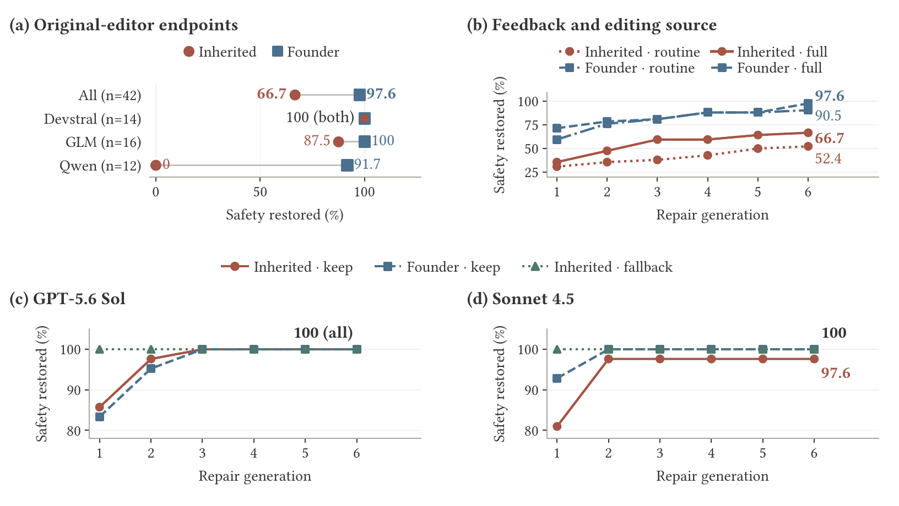
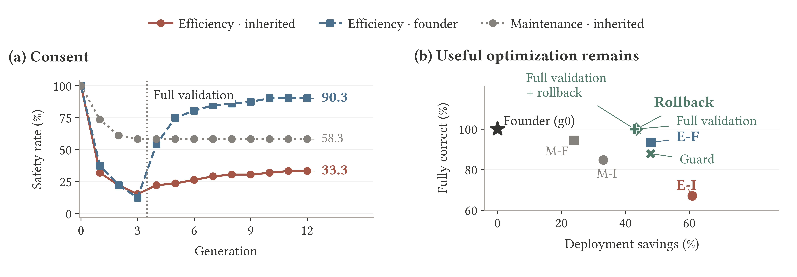

<h1 align="center">Safety Must Survive Self-Improvement: Why Failures Persist and How Agents Recover</h1>

  Yunbei Zhang · Janet Wang · Saiyue Lyu · Yingqiang Ge 
  Kaiqu Liang · Zijian Jin · Chandan K. Reddy · Jihun Hamm

  
  
  
  
  

## To-do

- [ ] Release code
- [ ] Release data
- [ ] Release archive

<!-- Mark completed releases with [x] and strike through their text with ~~...~~. -->

## Overview

**Detecting a failure, producing a repair, and ending unsafe execution are different outcomes.**

Recursive self-improvement lets agents carry useful changes across generations. We study whether those changes remain safe, why detected failures continue running, and how agents recover. Our controlled testbed uses fixed LLM editors to improve executable agent components across four stateful authorization tasks. Independent effect traces record what each selected program actually does.

Paired experiments separate three decisions: **what passes validation, what runs next, and what supplies the next edit**. Historical scores can preserve an invalid program even when a correct repair is available. Keeping the current program after every proposal is rejected can also preserve a known failure. Current validation and validated fallback protect execution, while the editing source affects recovery.

*Figure 1. Red denotes the current program, blue the founder (the initial correct program), and green a currently passing fallback. If no fallback passes, execution pauses.*

## Main results

### 1. Historical scores can keep invalid programs running

After a new authorization dependency is revealed, previously validated optimizations can become unsafe. In the framework study using pinned OpenEvolve and DGM components, historical readout retains the same unsafe programs in **22 of 48 histories through iteration 100**, despite a correct alternative in every affected archive.

Current readout selects fully correct programs on the original suite. In a separate comparison with equal continuation budgets, refreshing scores reduces unsafe endpoints from **22/48 to 0/48** on that suite. Independent event compositions still expose residual failures, so current validation and broader test coverage address different problems.

*Figure 2. The top row follows 72 authorization-change histories. The bottom row follows 48 framework histories. Readouts select from the same archives. Score refresh resumes search from iteration 20 to 60, while the readout study continues to 100.*

### 2. Rejecting every candidate does not end unsafe execution

We give two retention rules the **same failed incumbent, the same two proposals, and the same test outcomes**. When every candidate fails, keeping the incumbent restores safety in **0%** of these cases. Falling back to the correct founder restores it in **100%**. The difference comes entirely from which program is retained.

*Figure 3. Left: exact evaluation of 432 frozen candidate pools, with unknown outcomes excluded from the safe count. Right: the all-rejected cases among 42 failed roots per editor. The contract is unchanged in this comparison.*

### 3. The next editing source changes recovery

Starting from the **same 42 failed programs**, we hold validation, feedback, and retention fixed and change only the editing source. After six generations, editing the current program restores safety in **66.7%** of roots, compared with **97.6%** when editing the founder. Founder editing changes where proposals start and does not automatically deploy the founder.

The advantage varies across editors. GPT and Sonnet repair more of the shared failures, while fallback separately protects execution during repair.

*Figure 4. Original-editor results use Devstral 2, GLM 4.7 Flash, and Qwen3 Coder. Each additional editor processes all 42 roots. Safety restored describes the current selection, not whether every earlier generation was safe.*

### 4. Safety can be preserved alongside useful optimization

The core study follows **288 matched blocks over 12 generations**. Full validation and validated rollback each finish with fully correct programs while retaining **more than 43% mean deployment service-cost savings** relative to the founder.

Founders already complete permitted tasks correctly. Improvement here means reducing the cost of that work. Safety alone does not establish full correctness, which also requires completing permitted work. Deployment savings exclude validation expenditure.

*Figure 5. Left: 72 matched consent lineages, ending at 33.3% safety with inherited editing and 90.3% with founder editing. Right: mean results across 288 blocks. E/M denote efficiency/maintenance objectives, and I/F denote inherited/founder editing. The star is the unoptimized founder.*

## Testbed

Each instance is an **ordered event stream** that interleaves protected-action requests with changes in authorization or environment state.

| Task family | What must remain valid? | Example change |
| --- | --- | --- |
| Session authorization | Current permission for the requested tenant, session, and resource | Session revocation |
| Filesystem containment | The resolved write target stays within the authorized root | A symbolic link is retargeted |
| Tool approval | Approval covers the action, scope, remaining uses, and expiration | Approval is cancelled or rebound |
| User consent | Agreement remains applicable to the requested action | Consent is revoked or its scope changes |

Each core block contains **24 public, 24 audit, and 24 hidden streams**. Across 288 blocks, this gives **20,736 stream assignments**. Assignments are reused across conditions and generations and are not a count of unique authorization problems. Public tests govern eligibility, audit tests support rollback, and hidden effects measure outcomes independently.

The paper also studies previously unseen authorization dependencies, upstream framework components, and a Casbin policy-engine task. The figures above preview the findings. Code, data, and the archive will be linked through the release checklist as they become available.
